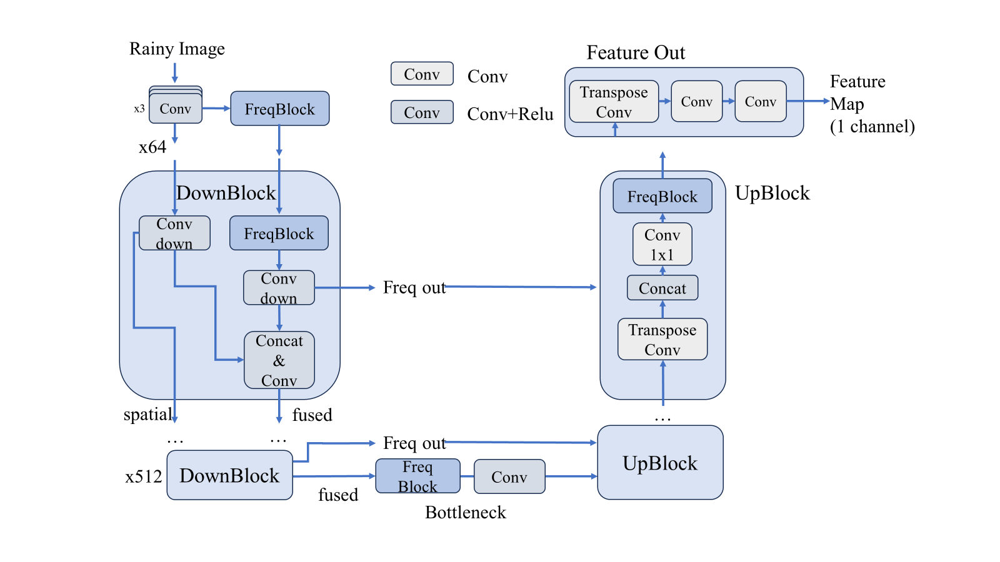
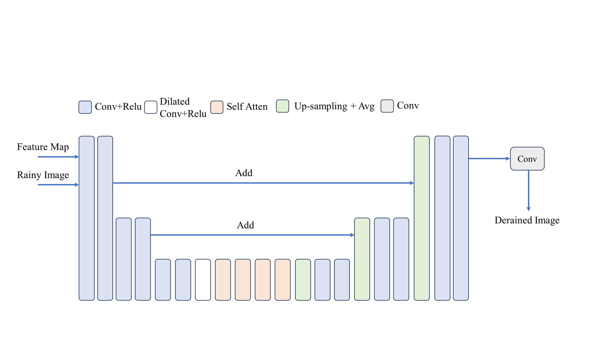
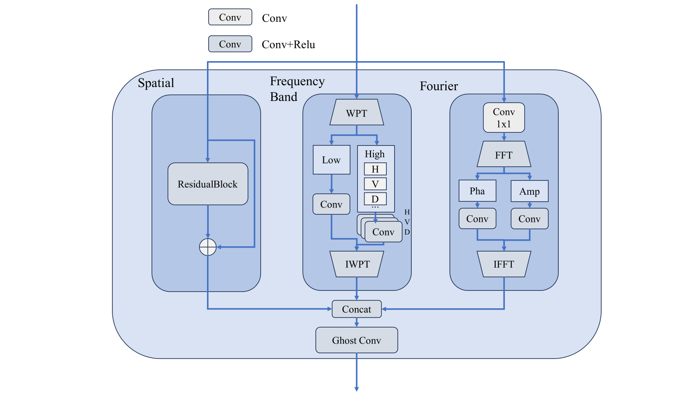
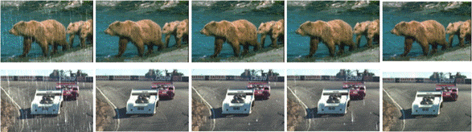

> final version: branch "ghost"

# Introduction

We propose a novel deep learning framework that integrates frequency domain analysis to augment feature representation. By introducing FreqBlock units, which combine Fourier and wavelet packet transforms, our model enriches the learning of features distinguishing rain streaks from clean background. Coupled with the UNet-SkipNet architecture, the proposed two-stage approach improves efficiency without compromising deraining accuracy. Experimental evaluations illustrate that the proposed framework achieves balanced deraining quality and efficiency, validating the efficacy of incorporating frequency domain features with the architecture. This offers a promising approach for image deraining tasks.

## Methods

## A.  Network Structure Design

Figure 1.   The UNet embedded with frequency domain analysis

### 1)   UNet Feature Extraction with FreqBlock Enhancement

As illustrated in Fig.1, we introduce modifications to the UNet structure by incorporating FreqBlocks, drawing inspiration from the necessity of comprehensive feature extraction. These blocks are instrumental in capturing multi-scale frequency information, refining the model's ability to discern rain streaks from the background. To preserve spatial information integrity, the U-Net incorporates an optimized multi-layer downsampling process alongside a convolutional layer, which, when combined with FreqBlock-extracted features. The initial input tensor has a dimensionality of 64 channels, which doubles with each downsampling layer until it reaches 512 channels at the bottleneck. The architecture then transitions to upsampling stages, gradually reducing the channel count back to 64, culminating in the final convolutional procedure that outputs a 1-channel feature map.

Figure 2.   The SkipNet used in stage two

### 2)   SkipNet for Image Reconstruction

Following feature extraction, SkipNet [10] is employed to merge features across different scales and reconstruct the final derained image. This stage is pivotal for maintaining high-frequency details, contributing to the overall deraining performance. The structure is shown in Fig.2.

Figure 3.   The architecture of the proposed FreqBlock

### 3)   FreqBlock: The Backbone Component

The FreqBlock is a cornerstone component, serving as a conduit for integrating features of multiple domains. The features from all three domains are concatenated later, forming a multi-perspective feature tensor. It is then processed through Ghost Convolution layers [11], which efficiently increase feature representation while reducing computational complexity, culminating in the derained output. As depicted in Fig.3, the module comprises three branches.

# Test

TABLE I.       Test Performance Of Mentioned Methods

| Methods | Result（PSNR/SSIM） |             |             |
| ------- | ------------------- | ----------- | ----------- |
|         | Rain100L            | Rain100H    | Test2800    |
| LPNet   | 33.28/0.943         | 23.40/0.822 | 22.03/0.765 |
| RESCAN  | 36.09/0.0.969       | 26.36/0.786 | 31.29/0.904 |
| PRENet  | 37.48/0.979         | 29.46/0.899 | 31.75/0.916 |
| Ours    | 37.81/0.965         | 29.65/0.902 | 30.12/0.894 |

From the results in Table 1, our model performs better than other models on the Rain100L dataset, indicating that the integration of frequency domain analysis enriches the features related to rain streaks that the model learns. We also provide deraining effect illustrations on the Rain100L dataset, showing that our model outperforms classical models in both rain removal and image reconstruction tasks.

| Raining | GT   | PRENet | RESCAN | ours |
| ------- | ---- | ------ | ------ | ---- |
|         |      |        |        |      |

Comparison of test results of different methods
